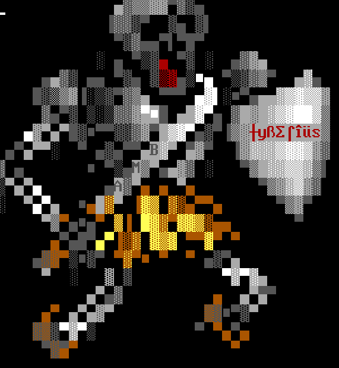

# xquest

**The King's Graveyard! v1.2**
An IGM (In-Game Module) quest for the Ambroshia v4.0 BBS door game.



## The Story

Someone or something has broken into the Royal Graveyard and stolen one of the most prized possessions of Ambroshia. King Tyberius' tomb has been robbed! It's up to YOU to help find him and restore his honor by returning him to his grave site!

## About

The King's Graveyard is one of the very first quests made for Ambroshia v4.0, featuring custom ANSI art, multiple enemy encounters, and a difficulty rating of HARD (4 days). Written in 2004 by xbit @ x-bit.org.

## Requirements

- Ambroshia v4.0 BBS door game

## Installation

1. Unzip all files into your Ambroshia Quests directory
2. Add the following line to your `Quests.dat` file:

```
The King's Graveyard <HARD 4 days>,Rob McGee (x-bit),xgrave.amb,
```

That's it!

## Files

| File | Description |
|---|---|
| `xgrave.amb` | Main quest file |
| `XQHD.ANS` | ANSI art — head |
| `XQ-TOR.ANS` / `XTOR.ANS` | ANSI art — torso |
| `XQ-LARM.ANS` / `XQ-RARM.ANS` / `XARMS.ANS` | ANSI art — arms |
| `XQLLEG.ANS` / `XQRLEG.ANS` / `XLEGS.ANS` | ANSI art — legs |
| `XQWEAP.ANS` / `XWEP.ANS` | ANSI art — weapons |
| `XTYBER.ANS` | ANSI art — King Tyberius |
| `xbats.txt` | Bat encounter text |
| `xbug.txt` | Bug encounter text |
| `xspider.txt` | Spider encounter text |
| `xabout.txt` | Quest description |
| `Install.txt` | Installation instructions |
| `file_id.diz` | BBS file description |

## Credits

- **xbit** (Rob McGee, x-bit.org) — Quest design, ANSI art, writing

## License

Released as-is for the Ambroshia BBS door community.
